# SQLAlchemy-Challenge: Charles Phil Week 10 Homework

## Climate analysis and exploration

### Dependencies

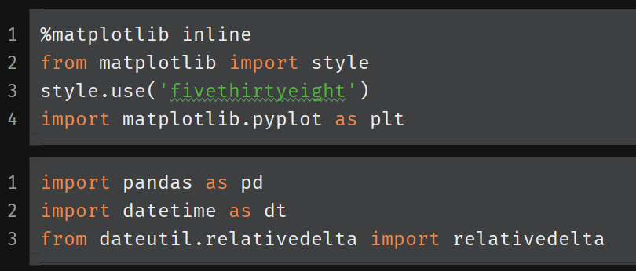

For this notebook, I kept most of the included dependencies but also included the dateutil module to use later for
calculating the date a year prior to a given date.

### Reflecting the database into the ORM

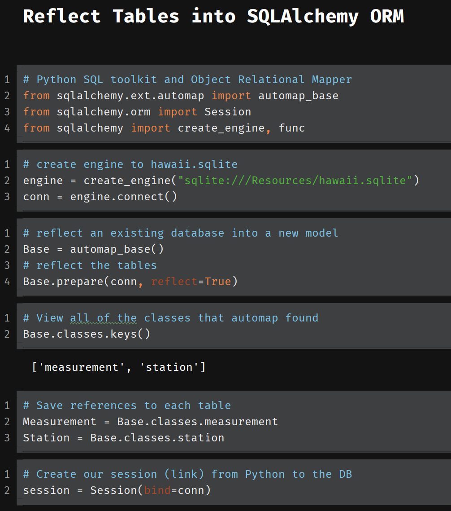

After importing the appropriate SQLAlchemy functions, I created the engine and connection to the sqlite database and
reflected those tables into their respective models. I looked for what tables were available for automap using 
`classes.keys()`. I then finished this section up by creating the session to complete the link to the database.

### Exploratory precipitation analysis

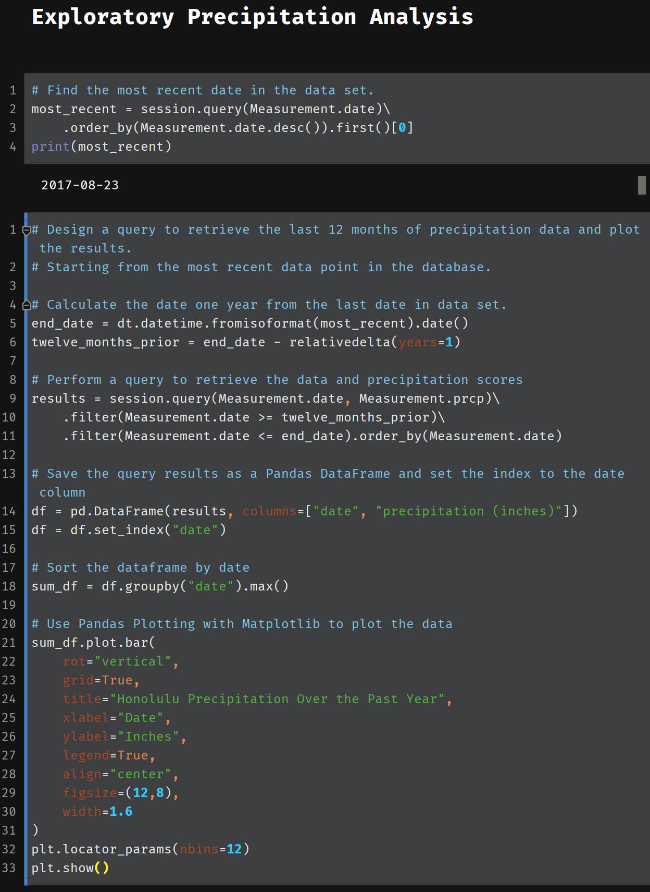

I found the most recent date in the dataset by querying for the date and ordering the results in descending order, and
only grabbing the first result that appeared. The `[0]` is to eliminate the tuple result, as I am going to be using the
string-formatted date in the following cell.

In the next cell, I translate the string-formatted date into an actual datetime object using the `fromisoformat` method
from the datetime library. I then call `date()` as I only want to look at the dates and not have any time information,
which can cause issues when querying the database. To get the date the year prior, I used dateutil's `relativedelta`
function, which automatically takes into account any leap years when working with differences in years. The reason why I
did not use datetime's `timedelta` function is because `timedelta` does not work beyond a time scale of days, which
means that any potential leap year must be dealt with manually (and 2016 was a leap year).

After making my query, I saved the results into a Pandas DataFrame. I had to provided column names as that information
does not carry over into my query from the database. I set the index to the date, grouped the data on those dates, and
aggregated those groups using the maximum precipitation.

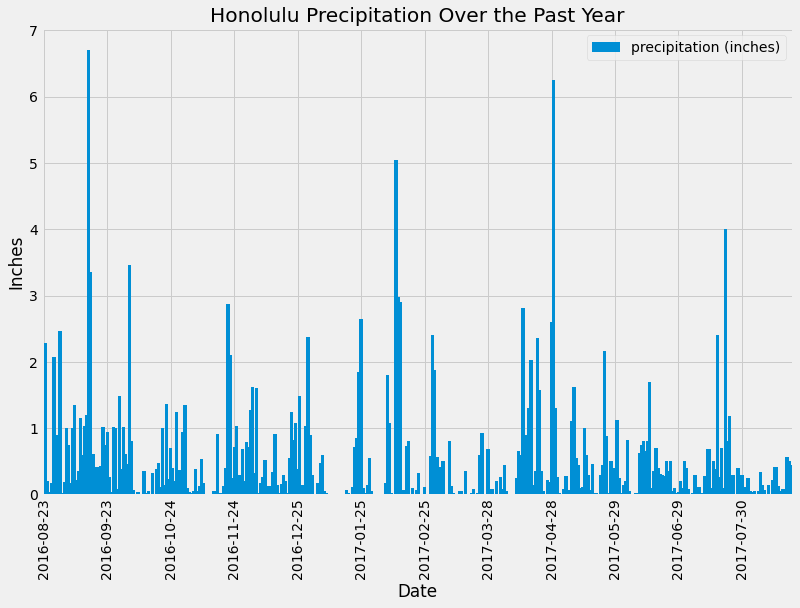

I then used the Pandas bar plot to plot all of the data, and used Matplotlib's `locator_params()` function in order to
get rid of all xtick labels except for 12 equidistant ones.

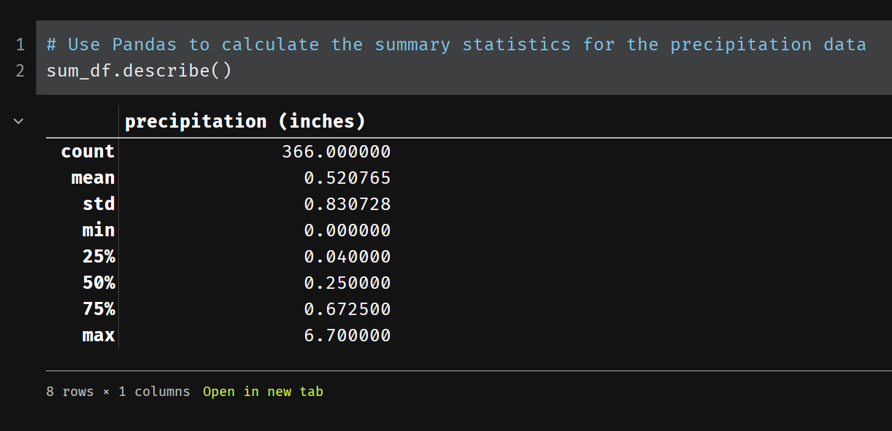

I wrapped up this section using Pandas `describe()` to obtain the summary statistics on the sorted DataFrame.

### Exploratory station analysis

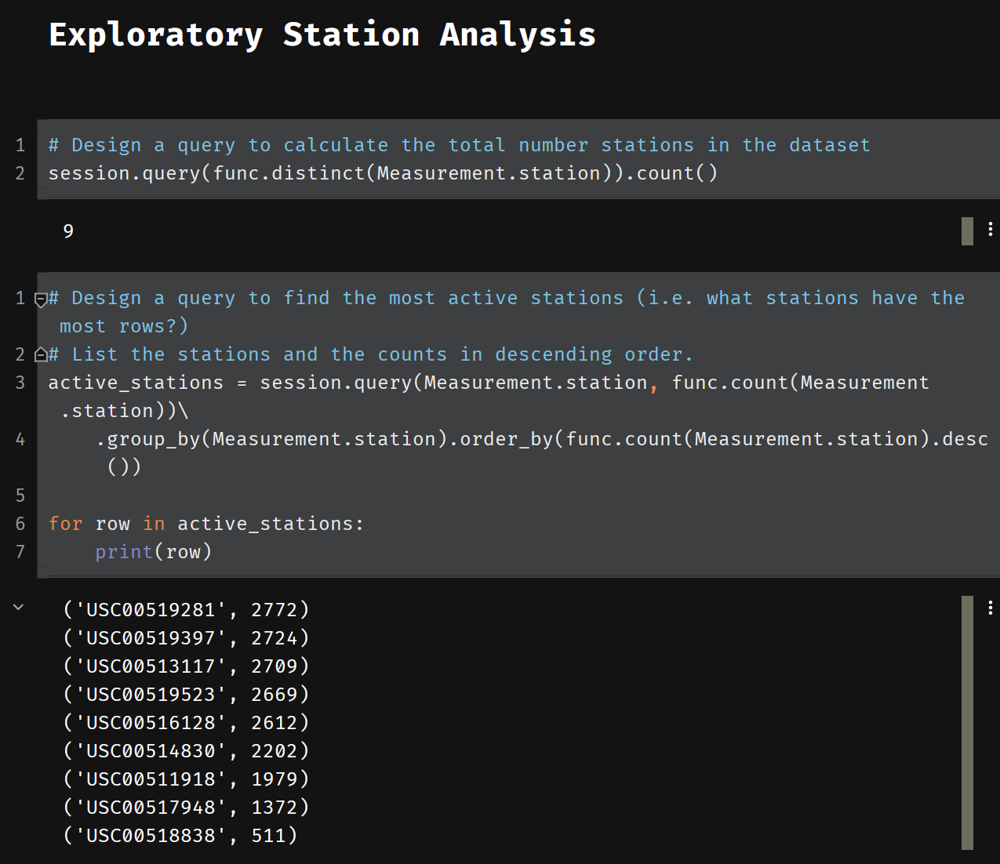

I ran a simple count method to determine the unique number of stations present in the measurements dataset. To determine
the station with the most number of appearances in the dataset, I ran a count function grouped by the stations in
descending order, which means the station with the most appearances will appear on top.

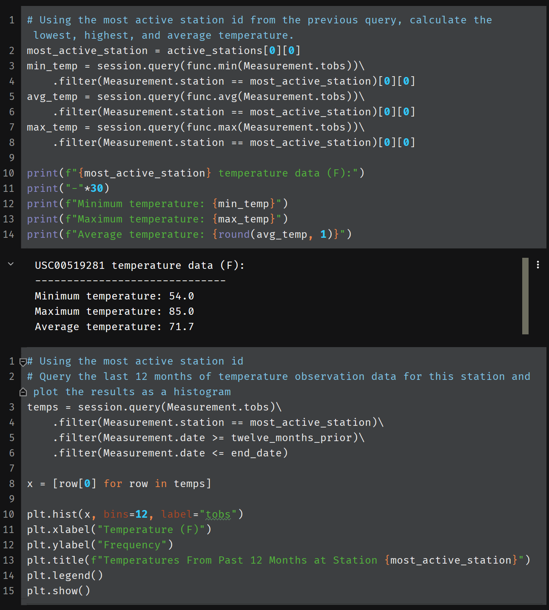

I then ran a `min`, `avg`, `max` function based on the most active station, and I grabbed those values directly in order
to output them into a somewhat nicer looking format in my print statements.

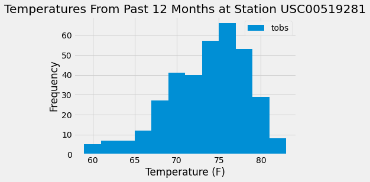

To create the histogram, I needed to grab the temperature values from all measurements that were taken. I used a list
comprehension to quickly grab the temperature that was sitting in the returned tuples from each row that was returned
from the query. 

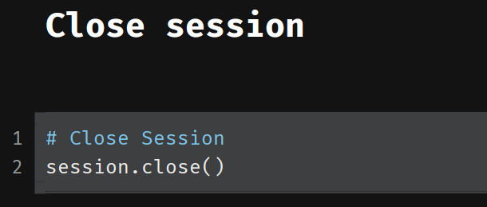

I then closed the ORM session.

## Creating the API

### Dependencies and connection

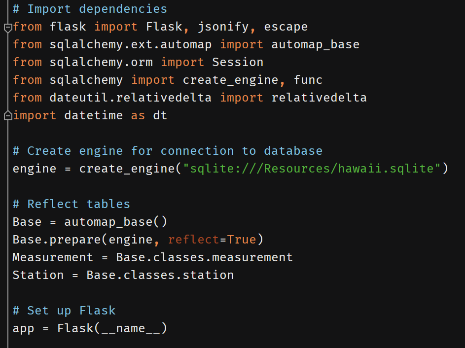

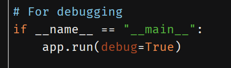

To prepare my Flask server, I included the needed boilerplate code in order to initialize and debug the Flask server. I
then used SQLAlchemy to automap the database into their respective models. I did recently find out that Flask has its
own extension of SQLAlchemy built in called Flask-SQLAlchemy. Because it simplifies how SQLAlchemy is used with Flask,
it may be worthwhile to learn in the future. For now, however, I stuck with the full SQLAlchemy library.

### Home page

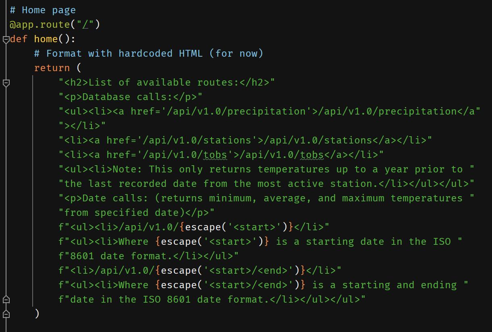

Even though we just needed to show which routes were available to the user, I decided to organize the routes a bit
better by using HTML to somewhat format the routes into a more cohesive unit. Additionally, I made the static API routes
hyperlinks so that the user could avoid having to type those routes into their browser. I also added a couple of notes
in order to clarify what the results and needed inputs are.

### Precipitation route

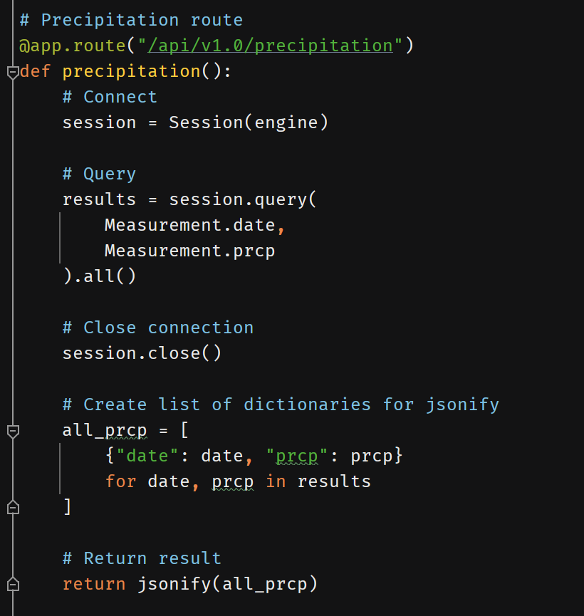

The first route was very straight forward. I connected the session to the database and then simply queried for all of
the dates and their respective precipitation amounts. After I got the results I needed, I closed the connection and then
used a list comprehension to create a list of dictionaries to convert into JSON for the end-user.

### Stations route

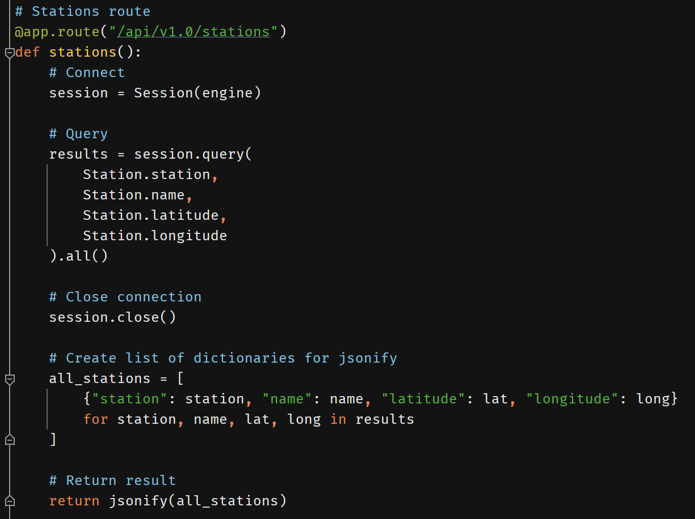

The stations route was identical to the precipitation route in terms of objectives.

### TOBS route

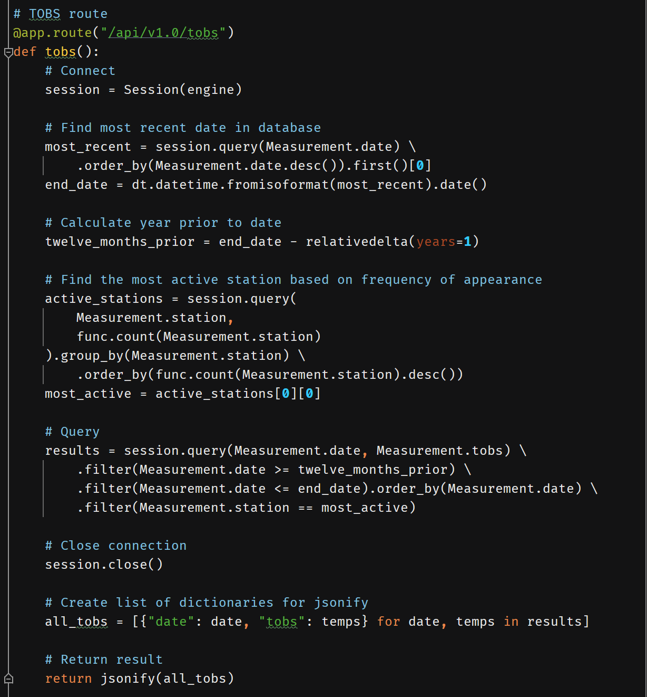

Because this route was only returning temperatures starting from the year before the last recorded date, and *only* for
the most active station, I had to make several filters based on those limitations. I used the datetime and dateutil
methods from the analysis and implemented them into this route. 

### Start route

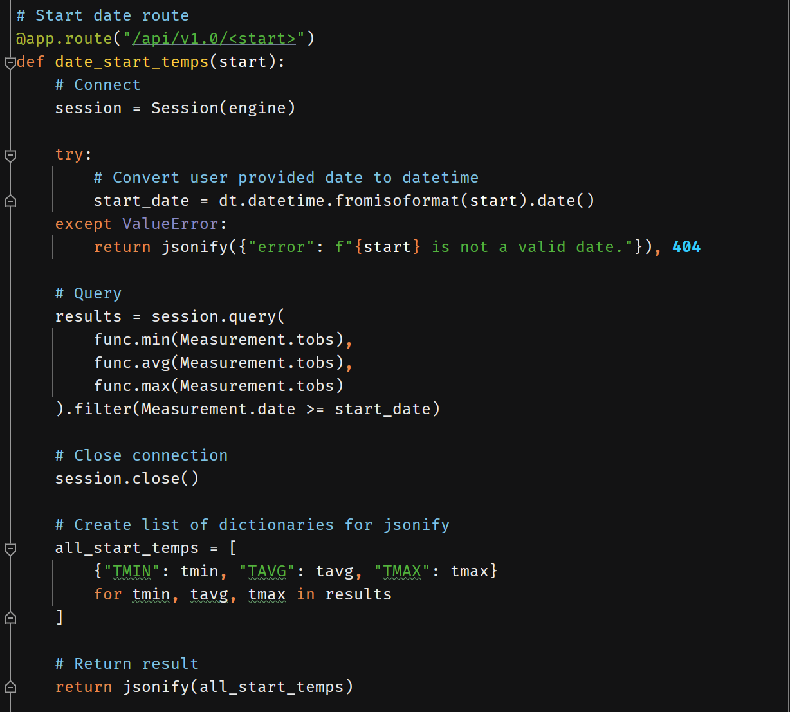

For the dynamic API calls, I used the `fromisoformat()` function from the dateutils module in order to convert the user
provided string date into a datetime object. However, if conversion fails, then the user is notified through a JSON
object that the provided date is not a valid date. After that, it is simply a matter of querying as usual and organizing
the data into a JSON object.

### Start-end route

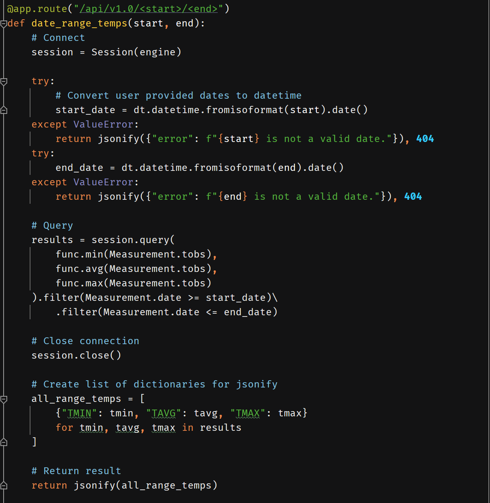

The idea here is the exact same as before, except now with the end date, we have to check to see if that end date is
also a valid date, and return a JSON object with an error that explains that the supplied date is not a valid date.

